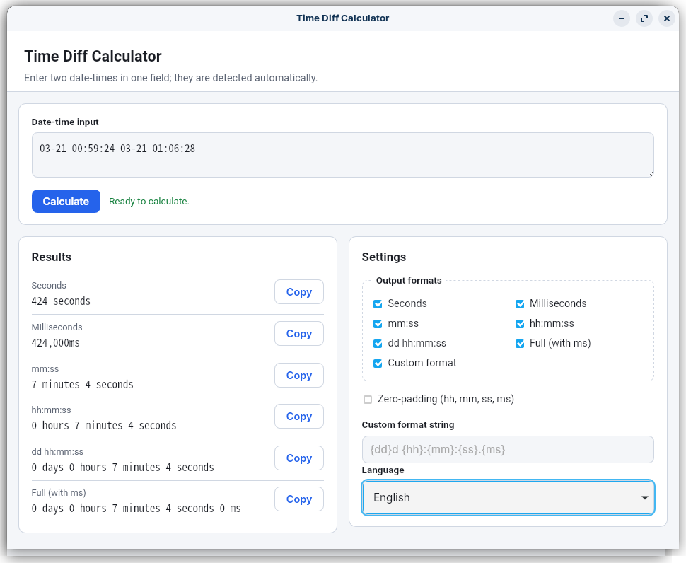

# Time Diff Calculator



[English](#english) | [한국어](#korean)

## English

### Overview

This desktop app helps you quickly calculate the time difference between two date-time values.  
Typical uses include checking elapsed time between project milestones, log timestamps, and schedule points.

### What you can do

- Enter two date-times in a single **Date-time input** field (the app auto-detects both values)
- View readable outputs in seconds, milliseconds, mm:ss, hh:mm:ss, and day-based formats
- Save and reuse your preferred output settings for repeated calculations

### Releases (pre-built binaries)

Pre-built executables are attached to each version on the [Releases](https://github.com/isul/Time-Diff-Calculator/releases) page:

- **timediff** — Linux
- **timediff.exe** — Windows

### Quick start (sample inputs)

In the **Date-time input** field, paste **one line** with two date-times, as shown below.

#### Sample input checklist (5)

- [ ] `2026-03-21 00:59:24 2026-03-21 01:06:28`
- [ ] `2026/03/21 00:00:00 2026/03/21 12:30:45`
- [ ] `2026.03.21 08:10:00.125 2026.03.21 08:10:10.875`
- [ ] `03-21 13:10:00 03-21 16:45:00` (if the year is omitted, the current year is used)
- [ ] `03/21 23:50:00 03/22 00:10:30`

#### Example output (all supported formats)

Using the following input, here is an example of every supported output format.

**Reference input:**

```text
2026-03-21 00:00:00.250 2026-03-22 02:03:04.750
```

**Reference settings:**

- Language: English
- Zero-padding: on
- Custom format string: `{dd}d {hh}:{mm}:{ss}.{ms} (total={total_seconds}s, {total_ms}ms)`

**Example results:**

- Seconds (`seconds`): `93784 seconds`
- Milliseconds (`milliseconds`): `93,784,500ms`
- mm:ss (`mmss`): `1563 minutes 4 seconds`
- hh:mm:ss (`hhmmss`): `26 hours 3 minutes 4 seconds`
- dd hh:mm:ss (`ddhhmmss`): `1 day 2 hours 3 minutes 4 seconds`
- Full (with ms) (`full`): `1 day 2 hours 3 minutes 4 seconds 500ms`
- Custom (`custom`): `01d 02:03:04.500 (total=93784s, 93784500ms)`

### Getting started (Windows 11)

#### 1) Run in development mode

```powershell
cd path\to\Time-Diff-Calculator
wails dev
```

#### 2) Run tests

```powershell
cd path\to\Time-Diff-Calculator
go test ./...
```

#### 3) Build the app

```powershell
cd path\to\Time-Diff-Calculator
.\scripts\build.ps1
```

Build artifacts are written under `build\bin\`.

### Common build options (Windows 11)

```powershell
cd path\to\Time-Diff-Calculator
.\scripts\build.ps1 -Native
.\scripts\build.ps1 -AllPlatforms
.\scripts\build.ps1 -NoTest
.\scripts\build.ps1 -Clean
.\scripts\build.ps1 -WailsArgs @('-platform','linux/amd64')
```

### Requirements

- Go 1.23+
- [Wails CLI v2](https://wails.io/) (`wails version`)

### Settings file location

User settings are stored in `timediff\settings.json` under the OS user configuration directory.  
On Windows, this is typically near `%APPDATA%\timediff\settings.json`.

### Regenerating bindings (development)

After adding or changing Go methods exposed to the frontend, run one of the following to refresh `frontend/wailsjs`:

- `wails dev`
- `wails build`
- `wails generate module`

---

<a id="korean"></a>

## 한국어 (Korean)

### 개요

두 날짜/시간 사이의 차이를 **쉽게 계산**하는 데스크톱 앱입니다.  
예: "프로젝트 시작일부터 오늘까지 며칠?", "두 시점 차이가 몇 시간?" 같은 계산을 빠르게 확인할 수 있습니다.

### 이 앱으로 할 수 있는 일

- **Date-time input** 한 칸에 날짜·시간 두 개를 넣어 차이 계산 (앱이 자동으로 두 시점을 인식)
- 일/시간/분/초 등 읽기 쉬운 형식으로 결과 확인
- 반복 계산 시 설정값 저장 후 다시 사용

### 릴리스(미리 빌드된 바이너리)

[Releases](https://github.com/isul/Time-Diff-Calculator/releases) 페이지에서 버전별로 빌드된 실행 파일을 내려받을 수 있습니다.

- **timediff** — Linux용
- **timediff.exe** — Windows용

### 빠른 사용법 (샘플 데이터)

**Date-time input** 입력란에 아래처럼 **한 줄로 그대로 입력**하면 됩니다.

#### 입력값 예시 체크리스트 (5개)

- [ ] `2026-03-21 00:59:24 2026-03-21 01:06:28`
- [ ] `2026/03/21 00:00:00 2026/03/21 12:30:45`
- [ ] `2026.03.21 08:10:00.125 2026.03.21 08:10:10.875`
- [ ] `03-21 13:10:00 03-21 16:45:00` (연도 생략 시 올해로 해석)
- [ ] `03/21 23:50:00 03/22 00:10:30`

#### 기대 결과(예시) - 지원 포맷 전체

아래 입력을 기준으로, 프로그램에서 지원하는 모든 출력 포맷 예시는 다음과 같습니다.

**기준 입력:**

```text
2026-03-21 00:00:00.250 2026-03-22 02:03:04.750
```

**기준 설정:**

- 언어: 한국어
- Zero-padding: 켜짐
- Custom format string: `{dd}d {hh}:{mm}:{ss}.{ms} (total={total_seconds}s, {total_ms}ms)`

**결과 예시:**

- 초 단위 (`seconds`): `93784초`
- 밀리초 (`milliseconds`): `93,784,500ms`
- 분:초 (`mmss`): `1563분 04초`
- 시:분:초 (`hhmmss`): `26시간 03분 04초`
- 일 시:분:초 (`ddhhmmss`): `01일 02시간 03분 04초`
- 전체(밀리초 포함) (`full`): `01일 02시간 03분 04초 500ms`
- 사용자 정의 (`custom`): `01d 02:03:04.500 (total=93784s, 93784500ms)`

### 처음 실행하기 (Windows 11 기준)

#### 1) 개발 모드 실행

```powershell
cd path\to\Time-Diff-Calculator
wails dev
```

#### 2) 테스트 실행

```powershell
cd path\to\Time-Diff-Calculator
go test ./...
```

#### 3) 앱 빌드

```powershell
cd path\to\Time-Diff-Calculator
.\scripts\build.ps1
```

산출물은 `build\bin\`에 생성됩니다.

### 자주 쓰는 빌드 옵션 (Windows 11)

```powershell
cd path\to\Time-Diff-Calculator
.\scripts\build.ps1 -Native
.\scripts\build.ps1 -AllPlatforms
.\scripts\build.ps1 -NoTest
.\scripts\build.ps1 -Clean
.\scripts\build.ps1 -WailsArgs @('-platform','linux/amd64')
```

### 요구 사항

- Go 1.23+
- [Wails CLI v2](https://wails.io/) (`wails version`)

### 설정 파일 위치

사용자 설정은 OS 사용자 설정 디렉터리의 `timediff\settings.json`에 저장됩니다.  
Windows에서는 보통 `%APPDATA%\timediff\settings.json` 경로 근처입니다.

### 개발 참고: 바인딩 갱신

Go 메서드를 추가/변경한 뒤 아래 명령 중 하나를 실행하면 `frontend/wailsjs`가 갱신됩니다.

- `wails dev`
- `wails build`
- `wails generate module`
